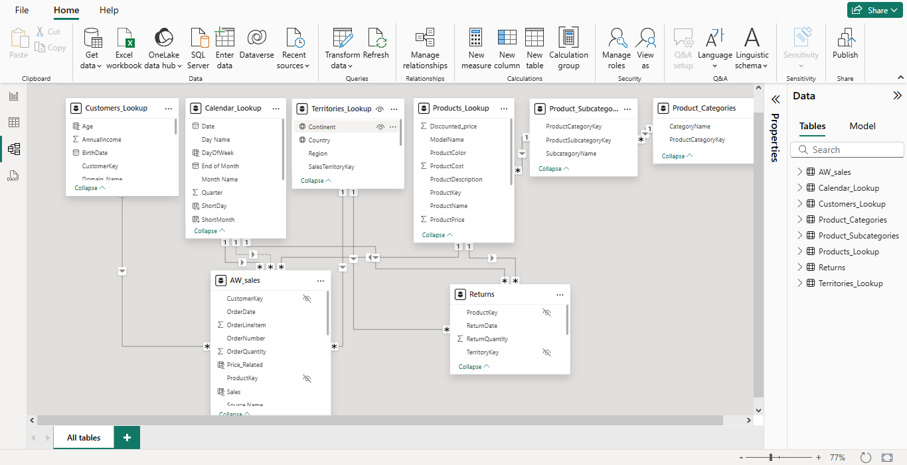
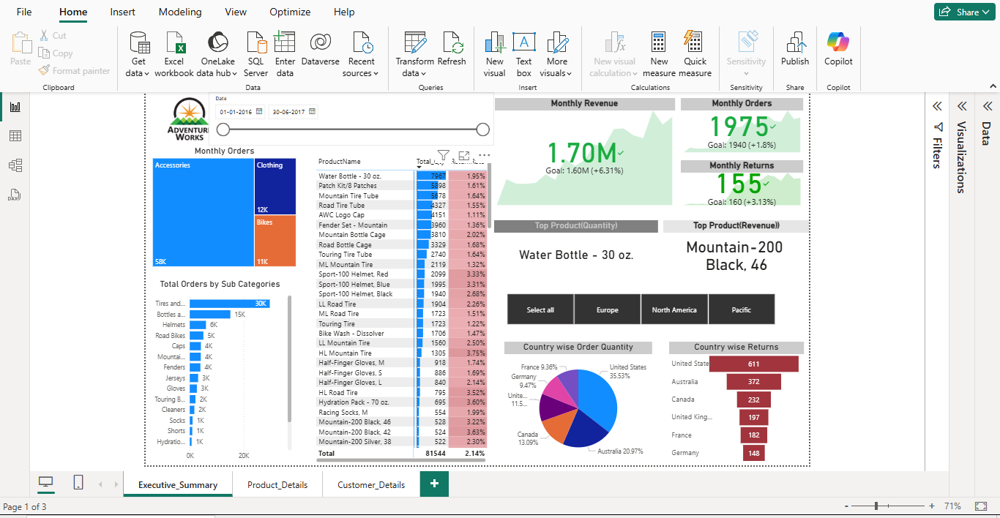
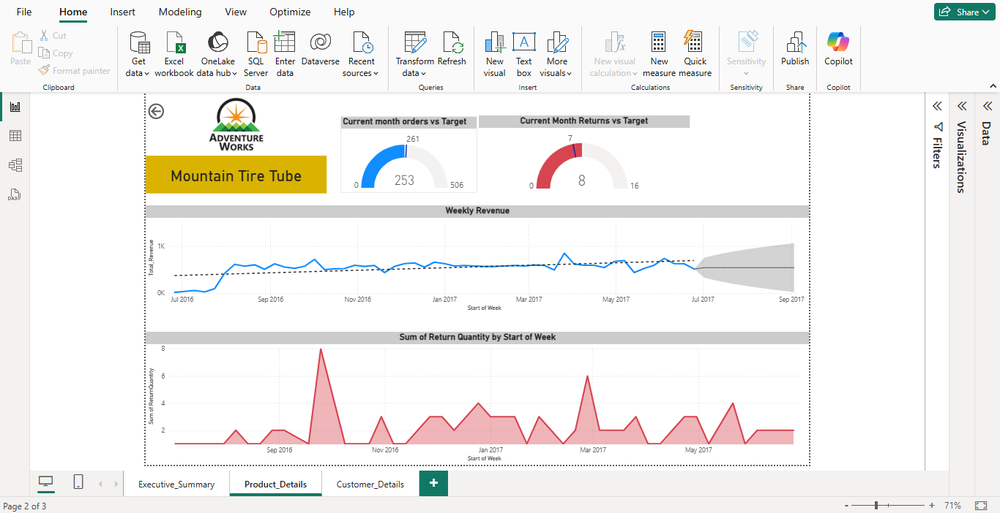

# **Sales Performance Report – Power BI**

## **Project Overview**

This project is an end-to-end Sales Performance Report built using Microsoft Power BI.
It covers data preparation, modeling, DAX calculations, and interactive dashboards to analyze sales, returns, customers, and products across multiple dimensions.

The report is designed for executive insights, product performance analysis, and customer behavior analysis.

----

## **Data Sources**

**Fact Tables** - Sales, Returns

**Lookup Tables** - Calendar, Customers, Products, Product Categories, Product Sub-Categories and Territories

---
                                             
## **Connecting & Shaping Data**

Combined multi-year sales data (2015–2017)

Standardized customer and product tables

Created calendar attributes (month, week, year, weekday/weekend)

Built territory hierarchies

Disabled refresh for static tables to improve performance

---

## **Creating a Data Model**

✔ Star-schema model
✔ Optimized filter flow
✔ Foreign keys hidden for cleaner reporting

---

## **Key DAX Highlights**

### **Calculated Columns**

Customer age, parent flag, full name

Calendar attributes (day type, short month/day)

Product price relationships

Sales amount calculation

### **Core Measures**

Total Orders, Quantity, Revenue

Returns & Return Rate

Month-over-Month comparisons

Order targets 

Weekend and bulk order analysis

---

## **Dashboards & Features**

### **Executive Summary**

#### **Key Insights**

Monthly order trends

Orders by product sub-category

Product-level performance with return rate

KPI tracking with month-over-month comparison

#### **Visual Highlights**

Tree chart for monthly orders

Stacked bar chart for orders by sub-category

Matrix with conditional formatting for return rate

KPI cards for:

Monthly Revenue

Monthly Orders

Monthly Returns

Top Product by:

Quantity

Revenue

Country-wise:

Order Quantity (Pie Chart)

Returns (Funnel Chart)

Dynamic slicers for Date, Year, and Continent

---

## **Product Details Page**

### Analysis Includes

Weekly revenue trends with forecasting

Weekly return quantity trends

Gauge charts comparing actual vs target:

Orders

Returns

Latest-month focused KPIs

Drill-through from Executive Summary for product-specific analysis

---

## **Customer Details Page**

### Insights Provided

Customer-level orders and revenue

Order distribution by:

Gender

Income Level

Occupation

Monthly trend comparison of orders and revenue

Age-based order distribution

Identification of top customers by:

Revenue

Order count

Navigation button to Executive Summary

---

## **Key Learnings**

End-to-end Power BI workflow

Data modeling best practices

Advanced DAX calculations

Executive-level dashboard design

Drill-through and navigation techniques

---

## **Business Value**

Enables leadership to monitor performance at a glance

Identifies high-return products and regions

Highlights top customers and products

Supports data-driven decisions with trend and forecast insights
